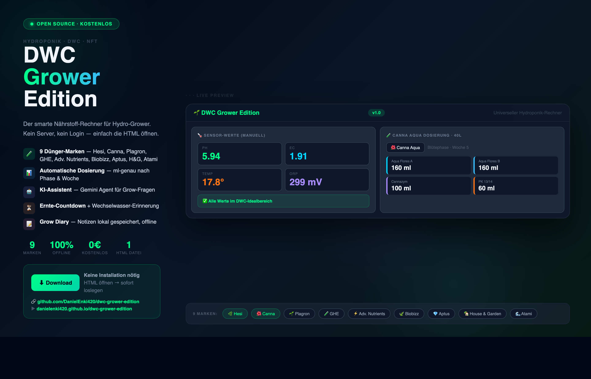

# 🌱 DWC Grower Edition — v1.2

> **Multi-Language** · **Multi-Brand** · **100% Local** · **No Cloud**

---

## 🌍 Languages / Sprachen / Lingue / Langues / Idiomas / Idiomas

| 🇩🇪 Deutsch | 🇬🇧 English | 🇮🇹 Italiano | 🇫🇷 Français | 🇪🇸 Español | 🇵🇹 Português |
|---|---|---|---|---|---|
| [Deutsch ↓](#-deutsch) | [English ↓](#-english) | [Italiano ↓](#-italiano) | [Français ↓](#-français) | [Español ↓](#-español) | [Português ↓](#-português) |

---

## 🇩🇪 Deutsch

**Der kostenlose Multi-Sprachen Hydroponik-Nährstoffrechner für DWC-Grower.**

### Features
- 🌍 **6 Sprachen** — Deutsch, Englisch, Italienisch, Französisch, Spanisch, Portugiesisch
- 🧪 **9 Dünger-Marken** — Hesi, Canna Aqua, Plagron Hydro, GHE Flora Series, Advanced Nutrients, Biobizz, Aptus, House & Garden, Atami B'cuzz
- 📊 Automatische Dosierung in ml — nach Phase & Woche
- ⚠️ pH / EC / Temp / ORP Warnsystem mit Empfehlungen
- ⏳ Ernte-Countdown + Wechselwasser-Erinnerung
- 📝 Grow Diary — lokal gespeichert im Browser
- 💧 EC-Nachfüll-Rechner mit Marken-Produktangabe
- 🤖 Gemini KI-Assistent — antwortet in deiner Sprache (eigener API-Key)
- 🌙 Dark & Light Mode
- 📱 Tablet & Mobile optimiert

### Nutzung
1. [**index.html öffnen**](https://danielenki420.github.io/dwc-grower-edition/)
2. Sprache oben rechts wählen 🇩🇪🇬🇧🇮🇹🇫🇷🇪🇸🇵🇹
3. Sensorwerte eingeben → Empfehlungen erscheinen sofort
4. Optional: Gemini API-Key eintragen für KI-Unterstützung

Alles läuft **100% lokal**. Kein Login, keine Cloud, keine Daten werden gesendet.

---

## 🇬🇧 English

**The free multi-language hydroponics nutrient calculator for DWC growers.**

### Features
- 🌍 **6 Languages** — German, English, Italian, French, Spanish, Portuguese
- 🧪 **9 Nutrient Brands** — Hesi, Canna Aqua, Plagron Hydro, GHE Flora Series, Advanced Nutrients, Biobizz, Aptus, House & Garden, Atami B'cuzz
- 📊 Automatic dosing in ml — by phase & week
- ⚠️ pH / EC / Temp / ORP warning system with recommendations
- ⏳ Harvest countdown + water change reminder
- 📝 Grow Diary — saved locally in browser
- 💧 EC refill calculator with brand-specific product suggestion
- 🤖 Gemini AI Assistant — responds in your language (own API key required)
- 🌙 Dark & Light Mode
- 📱 Tablet & mobile optimised

### Usage
1. [**Open index.html**](https://danielenki420.github.io/dwc-grower-edition/)
2. Select your language top right 🇩🇪🇬🇧🇮🇹🇫🇷🇪🇸🇵🇹
3. Enter sensor values → recommendations appear instantly
4. Optional: Add your Gemini API key for AI support

Everything runs **100% locally**. No login, no cloud, no data is sent.

---

## 🇮🇹 Italiano

**Il calcolatore gratuito multilingue per la nutrizione idroponica DWC.**

### Funzionalità
- 🌍 **6 Lingue** — Tedesco, Inglese, Italiano, Francese, Spagnolo, Portoghese
- 🧪 **9 Marchi di nutrienti** — Hesi, Canna Aqua, Plagron Hydro, GHE Flora Series, Advanced Nutrients, Biobizz, Aptus, House & Garden, Atami B'cuzz
- 📊 Dosaggio automatico in ml — per fase e settimana
- ⚠️ Sistema di allerta pH / EC / Temp / ORP con raccomandazioni
- ⏳ Conto alla rovescia del raccolto + promemoria cambio acqua
- 📝 Diario di coltivazione — salvato localmente nel browser
- 💧 Calcolatore di ricarica EC con suggerimento prodotto specifico del marchio
- 🤖 Assistente AI Gemini — risponde nella tua lingua (richiede chiave API personale)
- 🌙 Modalità Scura & Chiara
- 📱 Ottimizzato per tablet e mobile

### Utilizzo
1. [**Apri index.html**](https://danielenki420.github.io/dwc-grower-edition/)
2. Seleziona la lingua in alto a destra 🇩🇪🇬🇧🇮🇹🇫🇷🇪🇸🇵🇹
3. Inserisci i valori dei sensori → le raccomandazioni appaiono immediatamente
4. Opzionale: aggiungi la tua chiave API Gemini per il supporto AI

Tutto funziona **100% localmente**. Nessun login, nessun cloud, nessun dato inviato.

---

## 🇫🇷 Français

**Le calculateur de nutriments hydroponiques DWC multilingue et gratuit.**

### Fonctionnalités
- 🌍 **6 Langues** — Allemand, Anglais, Italien, Français, Espagnol, Portugais
- 🧪 **9 Marques de nutriments** — Hesi, Canna Aqua, Plagron Hydro, GHE Flora Series, Advanced Nutrients, Biobizz, Aptus, House & Garden, Atami B'cuzz
- 📊 Dosage automatique en ml — par phase et semaine
- ⚠️ Système d'alerte pH / EC / Temp / ORP avec recommandations
- ⏳ Compte à rebours de la récolte + rappel changement d'eau
- 📝 Journal de culture — sauvegardé localement dans le navigateur
- 💧 Calculateur de recharge EC avec suggestion de produit de la marque
- 🤖 Assistant IA Gemini — répond dans votre langue (clé API personnelle requise)
- 🌙 Mode Sombre & Clair
- 📱 Optimisé pour tablette et mobile

### Utilisation
1. [**Ouvrir index.html**](https://danielenki420.github.io/dwc-grower-edition/)
2. Sélectionner la langue en haut à droite 🇩🇪🇬🇧🇮🇹🇫🇷🇪🇸🇵🇹
3. Saisir les valeurs des capteurs → les recommandations apparaissent immédiatement
4. Optionnel : ajoutez votre clé API Gemini pour l'assistance IA

Tout fonctionne **100% localement**. Pas de connexion, pas de cloud, aucune donnée envoyée.

---

## 🇪🇸 Español

**La calculadora de nutrientes hidropónicos DWC multilingüe y gratuita.**

### Características
- 🌍 **6 Idiomas** — Alemán, Inglés, Italiano, Francés, Español, Portugués
- 🧪 **9 Marcas de nutrientes** — Hesi, Canna Aqua, Plagron Hydro, GHE Flora Series, Advanced Nutrients, Biobizz, Aptus, House & Garden, Atami B'cuzz
- 📊 Dosificación automática en ml — por fase y semana
- ⚠️ Sistema de alertas pH / EC / Temp / ORP con recomendaciones
- ⏳ Cuenta regresiva de cosecha + recordatorio de cambio de agua
- 📝 Diario de cultivo — guardado localmente en el navegador
- 💧 Calculadora de recarga EC con sugerencia de producto de marca
- 🤖 Asistente IA Gemini — responde en tu idioma (clave API propia requerida)
- 🌙 Modo Oscuro & Claro
- 📱 Optimizado para tablet y móvil

### Uso
1. [**Abrir index.html**](https://danielenki420.github.io/dwc-grower-edition/)
2. Selecciona el idioma arriba a la derecha 🇩🇪🇬🇧🇮🇹🇫🇷🇪🇸🇵🇹
3. Ingresa los valores de los sensores → las recomendaciones aparecen de inmediato
4. Opcional: agrega tu clave API de Gemini para soporte IA

Todo funciona **100% localmente**. Sin login, sin nube, sin datos enviados.

---

## 🇵🇹 Português

**A calculadora de nutrientes hidropónicos DWC multilingue e gratuita.**

### Funcionalidades
- 🌍 **6 Idiomas** — Alemão, Inglês, Italiano, Francês, Espanhol, Português
- 🧪 **9 Marcas de nutrientes** — Hesi, Canna Aqua, Plagron Hydro, GHE Flora Series, Advanced Nutrients, Biobizz, Aptus, House & Garden, Atami B'cuzz
- 📊 Dosagem automática em ml — por fase e semana
- ⚠️ Sistema de alertas pH / EC / Temp / ORP com recomendações
- ⏳ Contagem decrescente da colheita + lembrete de troca de água
- 📝 Diário de cultivo — guardado localmente no navegador
- 💧 Calculadora de recarga EC com sugestão de produto da marca
- 🤖 Assistente IA Gemini — responde no seu idioma (chave API própria necessária)
- 🌙 Modo Escuro & Claro
- 📱 Otimizado para tablet e móvel

### Utilização
1. [**Abrir index.html**](https://danielenki420.github.io/dwc-grower-edition/)
2. Seleciona o idioma no canto superior direito 🇩🇪🇬🇧🇮🇹🇫🇷🇪🇸🇵🇹
3. Introduz os valores dos sensores → as recomendações aparecem imediatamente
4. Opcional: adiciona a tua chave API Gemini para suporte IA

Tudo funciona **100% localmente**. Sem login, sem cloud, sem dados enviados.

---

## 🔧 Technical / Technisch

| | |
|---|---|
| **Version** | v1.2 |
| **Stack** | Pure HTML + CSS + Vanilla JS |
| **Dependencies** | None — zero frameworks |
| **Storage** | `localStorage` only |
| **AI** | Google Gemini API (optional) |
| **License** | [MIT](LICENSE) |

---

*🌿 Free & Open Source — for the global grower community*
